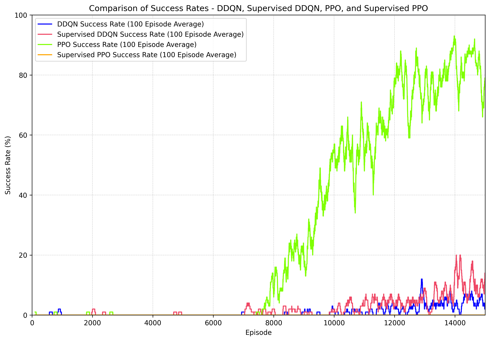

# IDATT2502 - Project Autumn 2024
- Written by: Jens Christian Aanestad, Anders Høvik, Henrik Teksle Sandok, Andreas Kluge Svendsrud

## Project Assignment
### Various Reinforcement Learning Tasks
#### Task Suggestions:
- Choose an environment (e.g., from [Gymnasium](https://gymnasium.farama.org/)) and test different algorithms.
- Choose an algorithm and test it in different environments.
- Create a custom environment for reinforcement learning.
- Explore different configurations of a single algorithm.

For this project, we chose to test different algorithms on the [gym-super-mario-bros](https://pypi.org/project/gym-super-mario-bros/)
environment by [Christian Kauten](https://pypi.org/user/kautenja/). We also focused on exploring ways to improve these algorithms through supervised learning.

## Research Question
Which Reinforcement Learning algorithm best enhances
Mario’s learning and success rate, and can combining these algorithms with Supervised Learning further
optimize performance?

## Requirements
Requirements to run the project:
- **Python 3.9 - 3.11**

## Installation
To install the required dependencies, follow these steps:
1. Clone the repository
```bash
git clone https://github.com/kluge7/IDATT2502-NES-SM-ML.git
```
2. Navigate to the project directory
```bash
cd IDATT2502-NES-SM-ML
```
3. Install the required dependencies
```bash
pip install -r requirements.txt
```

## How to Run
The following are the commands to run the project:

(Depending on what python version you are using, use python or python3 in the commands)

### Train models

#### Train with PPO
To train models with PPO you use the following commands:

```bash
python main.py train --method=PPO
```
This will train the PPO model from scratch on world 1 stage 1 (SuperMarioBros-1-1-v0)

If you want to train on another world or stage use this command:
```bash
python main.py train --method=PPO --world=4 --stage=2
```

To continue to train from trained models, you would have to load them:
```bash
python main.py train --method=PPO
--actor_load_path=--actor_load_path="src/ppo/model/ppo_actor.pth"
--critic_load_path=--critic_load_path="src/ppo/model/ppo_critic.pth"
```

There are many more arguments you can set. For more details, check out the [main.py](./main.py) file.

#### Train with DDQN
To train models with DDQN, use this command:
```bash
python main.py train --method=DDQN --episodes=15000
```

To train from an already trained model, use this command:
```bash
python main.py train --method=DDQN
--ddqn_model_save="src/ddqn/model/ddqn_1-1.pth"
```

### Test models

#### Test with PPO models
To test trained ppo models, you can use the following commands:

```bash
python main.py test --method=PPO
--actor_load_path=--actor_load_path="src/ppo/model/ppo_actor.pth"
--critic_load_path=--critic_load_path="src/ppo/model/ppo_critic.pth"
```

Note that this will only display for one episode. If you want to test for several episodes use this command:
```bash
python main.py test --method=PPO
--test_episode_number=5
--actor_load_path=--actor_load_path="src/ppo/model/ppo_actor.pth"
--critic_load_path=--critic_load_path="src/ppo/model/ppo_critic.pth"
```

Alternatively, you can also record the gameplay. To do this you would have to install this external library:
(The size is 80 Mb)
```bash
iwr -Uri https://www.gyan.dev/ffmpeg/builds/ffmpeg-release-essentials.zip -OutFile ffmpeg.zip; `
Expand-Archive -Path ffmpeg.zip -DestinationPath .; `
Move-Item -Path .\ffmpeg-* -Destination .\ffmpeg; `
$env:Path += ";$PWD\ffmpeg\bin"; `
rm ffmpeg.zip
```

After installing this library in current directory, you can record with this cammnd:
```bash
python main.py test --method=PPO
--record=True
--actor_load_path=--actor_load_path="src/ppo/model/ppo_actor.pth"
--critic_load_path=--critic_load_path="src/ppo/model/ppo_critic.pth"
```

#### Test with DDQN models
To test DDQN models use this command:
```bash
python main.py test --method=DDQN
--record=True
--ddqn_model_save="src/ddqn/model/ddqn_1-1_supervised.pth"
--eval_runs=5
```
This will record and use provided DDQN model for 5 episodes.


## Training performance
#### Episodic rewards over all algorithms


#### Success rate over all algorithms


## Results

#### DDQN


#### Supervised DDQN


#### PPO


#### Supervised PPO

